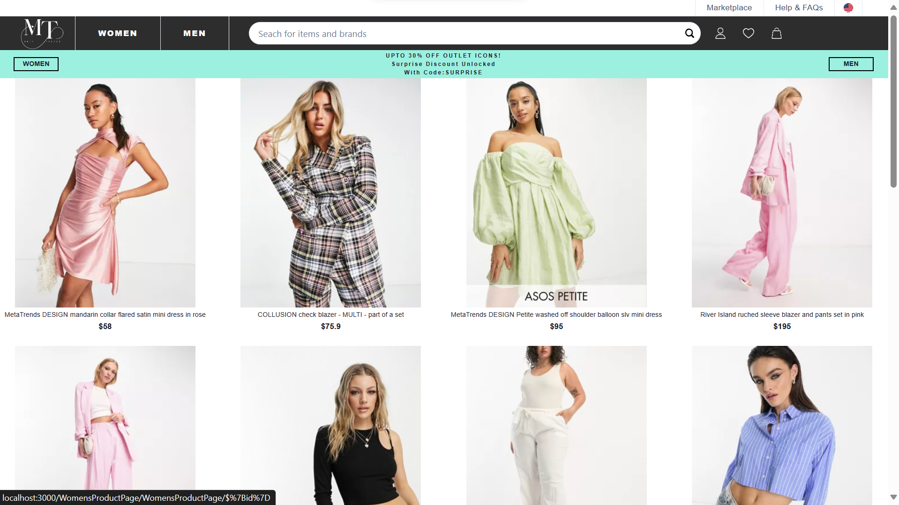
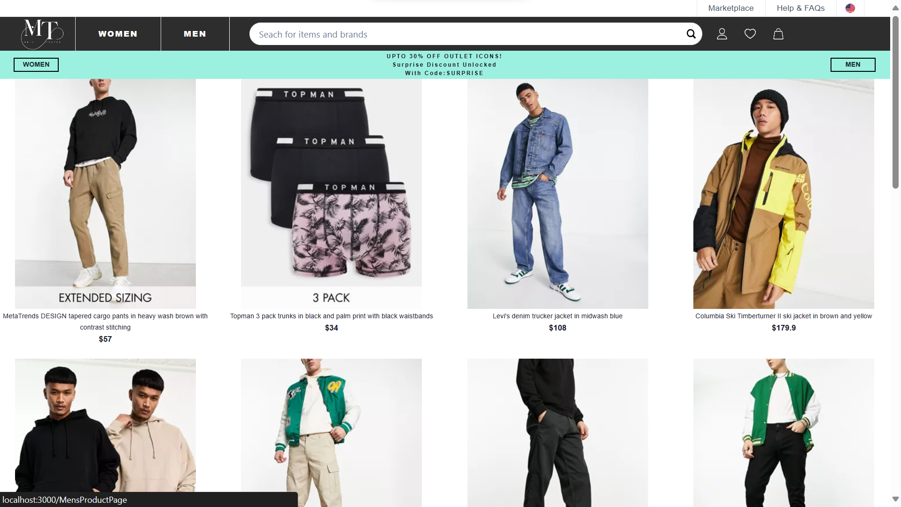
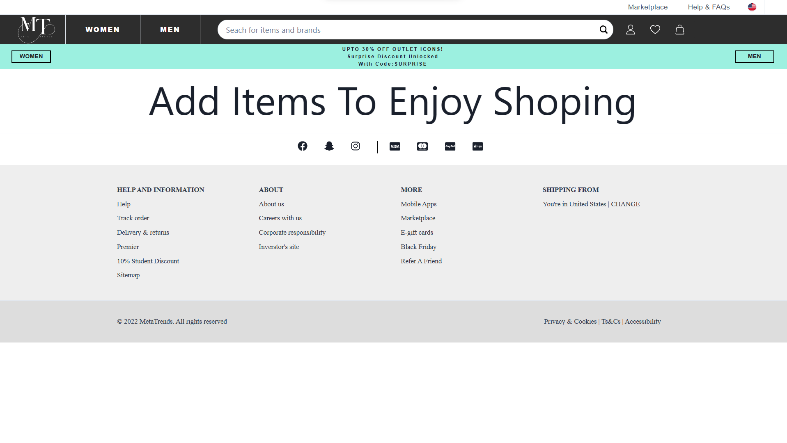
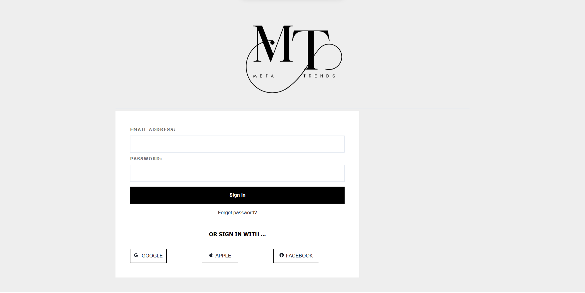
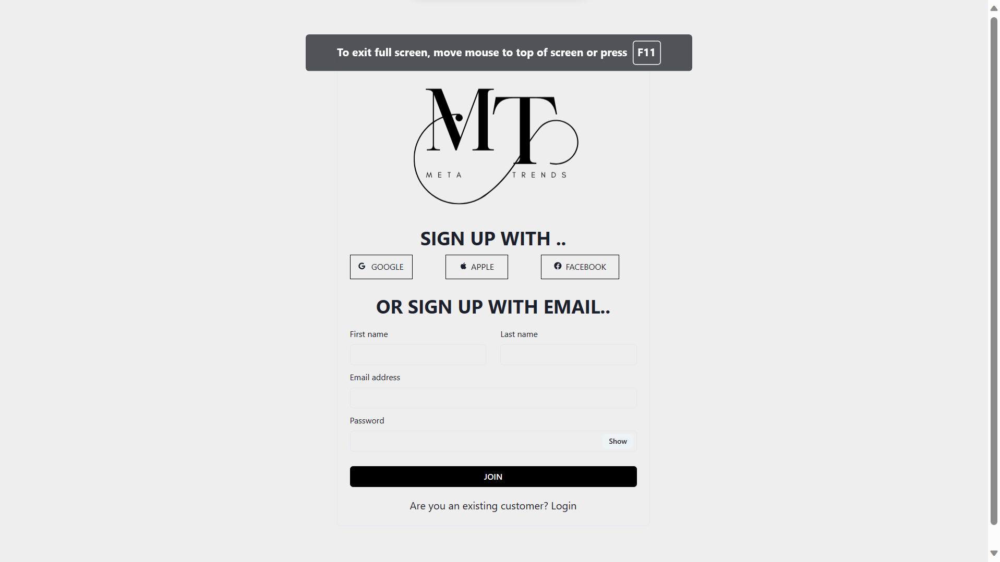

<h1><a href="https://agile-wheel-3721.netlify.app/">Meta Trends</a></h1>
<h2>About</h2>
<h3>Its an E-commerce websit used for shopping fashion outfits built within a span of 5 days as solo collabrator.</h3>
<h2>Tech Stacks used:</h2>
<ul>
<li>HTML</li>
<li>CSS</li>
<li>JavaScript</li>
<li>React</li>
</ul>
<ul>
<h2>HomePage</h2>

<h2>Womens Products</h2>

<h2>Mens Products</h2>

<h2>Cart </h2>

<h2>Login </h2>

<h2>Sign Up </h2>

 
